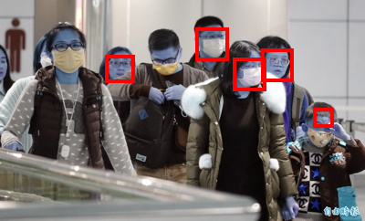

# Face mask detection

This code is developed with the Detectron2 library.
I have utilized a Mask R-CNN with ResNet-50 backbone to address the 
task of detecting three types of scenarios.

1. Mask worn correctly
2. Mask not worn correctly
3. Mask not worn

As there are only 853 training images I have utilized all images 
to train the model. 

The data clean up code is available in *dataset_analysis_cleanup.ipynb* 
notebook. This code also contains the steps to generate a train, test 
and validation split but it has been commented for now due to the 
limited data available for this dataset. I have also added the code 
to generate a COCO file from a pandas DataFrame that contains the 
co-ordinates of each type of object in an image. The generated COCO 
file is used to feed the data to the model. 

The *Mask_Detecion.ipynb* notebook contains the code
to train a model with Detecron2 and to visualize the results.

The results from the trainined model are shown below:

*Note: This code was developed on Google Colab Pro*

Future work: More training and augmentation is required to improve 
the performance of the model.